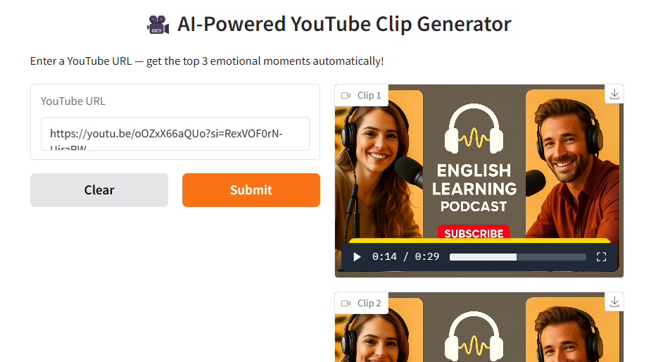

# 🎬 YouTube AI Clip Generator

Generate smart clips from YouTube podcasts using sentiment + emotion analysis.

## ⚠️ Prerequisite: Install FFmpeg

Your system needs FFmpeg to extract video clips.

### Windows
1. Download the build from [https://ffmpeg.org/download.html](https://ffmpeg.org/download.html)
2. Extract the ZIP
3. Add the `bin` folder to your system PATH

### Mac
```bash
brew install ffmpeg
```

### Linux (Debian/Ubuntu)
```bash
sudo apt update
sudo apt install ffmpeg
```

## 🚀 How to Run

1. Get the project files:
   - **Option 1: Clone the repo (requires Git)**
     ```bash
     git clone https://github.com/prismvale/Podcast-highlights.git
     cd Podcast-highlights
     ```
   - **Option 2: Download ZIP**
     1. Go to the GitHub repo page
     2. Click **Code → Download ZIP**
     3. Extract the ZIP folder
     4. Open terminal and navigate into the extracted folder

2. Install requirements:
   ```bash
   pip install -r requirements.txt

3. Run the Gradio app:
   ```bash
   python Podcast-highlights.py
   
Open the link shown in terminal (usually http://127.0.0.1:7860) in a browser.



